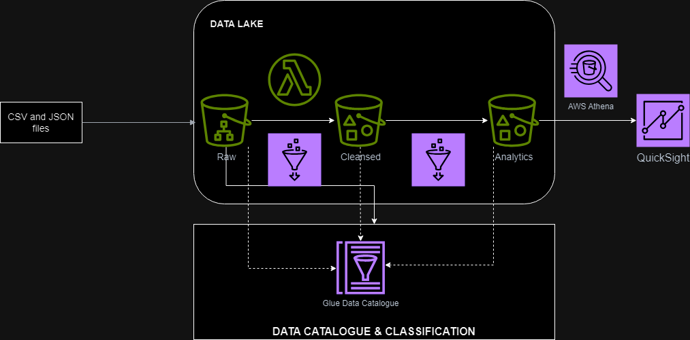
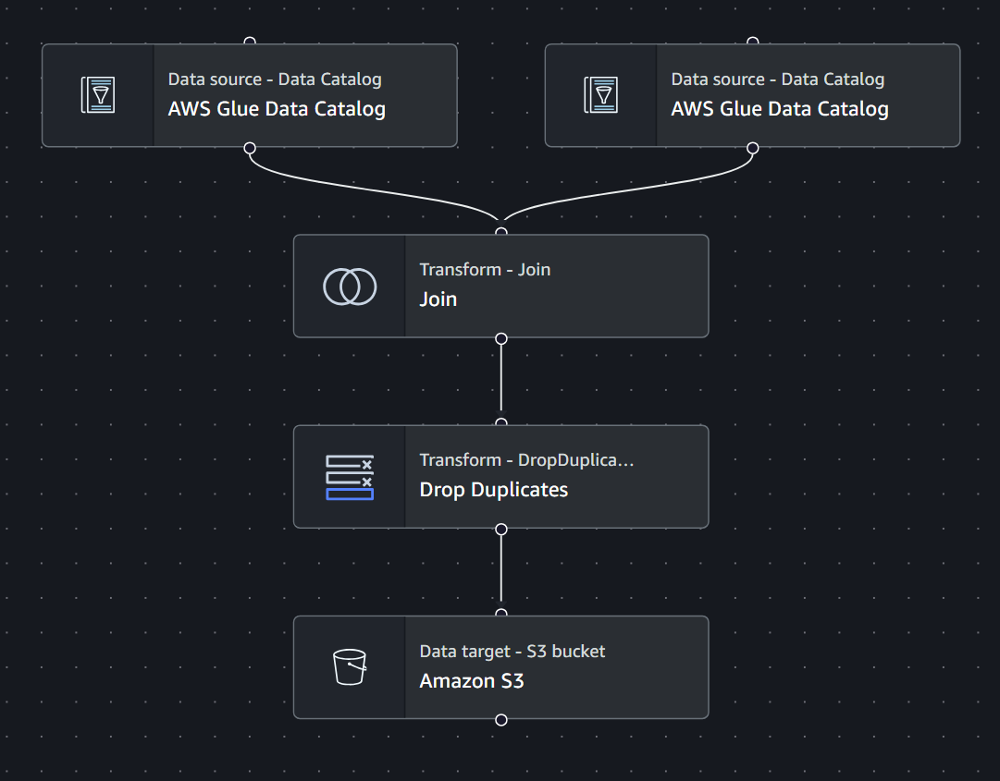

# YouTube Statistics Data Analytics | Data Engineering AWS Project

## Introduction
This data engineering project aims to leverage AWS services to analyze YouTube statistics. By utilizing S3 for data storage, Lambda for event-driven processing, Glue for ETL tasks, Athena for interactive querying, QuickSight for data visualization, and IAM for secure access control, we will create a robust and scalable solution to extract valuable insights from YouTube data. This project will enable us to explore trends, user behavior, and performance metrics to make data-driven decisions.

## Architecture

## Technology Used
1. Python
2. SQL
3. Amazon Web Services:
    - IAM
    - S3
    - Lambda
    - Glue
    - Athena
    - QuickSight

## Dataset Used
This Kaggle dataset includes several months (and counting) of data on daily trending YouTube videos. Data is included for many locations, with up to 200 listed trending videos per day. Each region’s data is in a separate file(CSV files). Data includes the video title, channel title, publish time, tags, views, likes and dislikes, description, and comment count. The data also includes a category_id field, which varies between regions. To retrieve the categories for a specific video, find it in the associated JSON. One such file is included for each of the five regions in the dataset.

### More Information About Dataset
- Original Data Source - https://www.kaggle.com/datasets/datasnaek/youtube-new

## Analytic ETL Job

